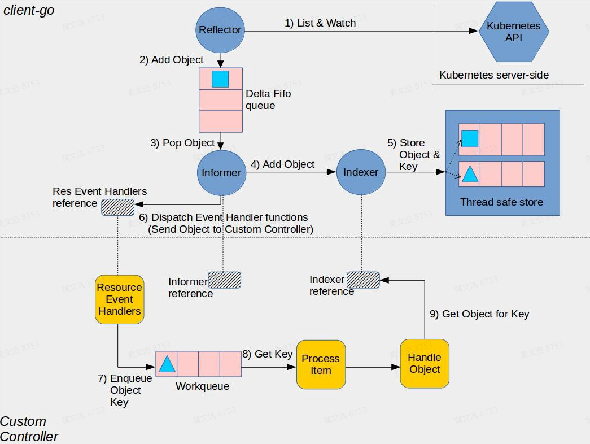

# 1. 
## 1.1 Client go介绍

当使用 Kubernetes 进行应用程序的开发和部署时，client-go 是一个非常重要的工具。它是 Kubernetes 的官方客户端库，提供了与 Kubernetes ApiServer 进行通信的接口和实现。
client-go 主要提供以下几个功能：

1. 与 Kubernetes ApiServer 进行通信：client-go 提供了与 Kubernetes ApiServer 进行通信的接口和实现，包括基本的 http 请求和更深层次的封装。开发人员可以使用 client-go 创建、更新和删除 Kubernetes 中的资源。
2. 访问 Kubernetes ApiServer 中的资源：client-go 提供了访问 Kubernetes ApiServer 中资源的方法，包括使用 ClientSet 进行基于对象的访问和使用 DynamicClient 进行基于无类型的访问。
3. 处理 Kubernetes 资源的事件：client-go 提供了一种称为 Informer 的机制，它可以监听 Kubernetes ApiServer 中的资源变更事件。开发人员可以使用 Informer 实现资源的快速检索和本地缓存，从而减轻对 ApiServer 的访问压力。
4. 发现 Kubernetes ApiServer 中的资源：client-go 还提供了 DiscoveryClient 接口，该接口可以用于在 Kubernetes ApiServer 中查询当前集群的资源及其版本.


## 1.2 Informer介绍
在 Kubernetes 中，Informer 是一个客户端库，用于监视 Kubernetes API 服务器中的资源并将它们的当前状态缓存到本地。Informer 提供了一种方法，让客户端应用程序可以高效地监视资源的更改，而无需不断地向 API 服务器发出请求。

### 1.2.1 K8s HTTP API 的 List Watch 机制
K8s API Server 提供了获取某类资源集合的 HTTP API，此类 API 被称为 List 接口。例如下面的 URL 可以列出 default namespace 下面的 pod。
```shell
HTTP GET api/v1/namespaces/default/pods
```
在该 URL 后面加上参数 ?watch=true，则 API Server 会对 default namespace 下面的 pod 的状态进行持续监控，并在 pod 状态发生变化时通过 chunked Response (HTTP 1.1) 或者 Server Push（HTTP2）通知到客户端。K8s 称此机制为 watch。
```shell
HTTP GET api/v1/namespaces/default/pods?watch=true
```
通过 curl 来 List pod 资源。
```shell
curl http://localhost:8080/api/v1/namespaces/default/pods
```
### 1.2.2 为什么使用informer

采用 k8s HTTP API 可以查询 K8s API 资源对象并 Watch 其变化，但大量的 HTTP 调用会对 API Server 造成较大的负荷，而且网络调用可能存在较大的延迟。除此之外，开发者还需要在程序中处理资源的缓存，HTTP 链接出问题后的重连等。为了解决这些问题并简化 Controller 的开发工作，K8s 在 client go 中提供了一个 informer 客户端库。

相比直接采用 HTTP Watch，使用 Kubernetes Informer 有以下优势：

减少 API 服务器的负载：通过在本地缓存资源信息，Informer 减少了需要向 API 服务器发出的请求数量。这可以防止由于 API 服务器过载而影响整个集群的性能。

提高应用程序性能：使用缓存的数据，客户端应用程序可以快速访问资源信息，而无需等待 API 服务器响应。这可以提高应用程序性能并减少延迟。

简化代码：Informer 提供了一种更简单、更流畅的方式来监视 Kubernetes 中的资源更改。客户端应用程序可以使用现有的 Informer 库来处理这些任务，而无需编写复杂的代码来管理与 API 服务器的连接并处理更新。

更高的可靠性：由于 Informer 在本地缓存数据，因此即使 API 服务器不可用或存在问题，它们也可以继续工作。这可以确保客户端应用程序即使在底层 Kubernetes 基础结构出现问题时也能保持功能。


### 1.2.3 Informer 更新机制

1. Reflector 采用 K8s HTTP API List/Watch API Server 中指定的资源。
 Reflector 会先 List 资源，然后使用 List 接口返回的 resourceVersion 来 watch 后续的资源变化。对应的源码：Reflector ListAndWatch。
1. Reflector 将 List 得到的资源列表和后续的资源变化放到一个 FIFO（先进先出）队列中。
对应的源码：
   - 使用 List 的结果刷新 FIFO 队列
   - 将 Watch 收到的事件加入到 FIFO 队列
1. Informer 在一个循环中从 FIFO 队列中拿出资源对象进行处理。对应源码：processLoop。
2. Informer 将从 FIFO 队列中拿出的资源对象放到 Indexer 中。对应的源码：processDeltas。
3. Indexer 是 Informer 中的一个本地缓存，该缓存提供了索引功能（这是该组件取名为 Indexer 的原因），允许基于特定条件（如标签、注释或字段选择器）快速有效地查找资源。此处代码中的 clientState 就是 Indexer，来自于NewIndexerInformer方法中构建的 Indexer，该 Indexer 作为 clientState 参数传递给了 newInformer 方法。

Indexer 将收到的资源对象放入其内部的缓存 ThreadSafeStore 中。
  



<!-- 注释为代码实现流程
Informer 的大体流程如下：

1. new 一个 informer，创建 informer 第一个参数是一个 ListWatch 的接口类型（这个就是获取 apiserver 数据）。

2. informer.Run 的时候，会 new 一个 Reflector 对象。Reflector 包含了 ListWatch ，接下来基本就是 Reflector 进行操作了。

3. Reflector 对 ListWatch 来的数据进行处理，这里使用到了 DeltaFIFO 队列对 watch 来的数据一个个的处理，HandleDeltas 函数。

4. 具体的处理逻辑分为两部分，第一部分是，通过操作 cache.indexer ，更新本地缓存 + 索引; 第二部分是，将 watch 的数据发送给 Informer 自定义的处理函数进行处理。 -->
### 1.2.4 SharedInformer
**为什么要使用sharedinformer**
如果在一个应用中有多处相互独立的业务逻辑都需要监控同一种资源对象，用户会编写多个 Informer 来进行处理。这会导致应用中发起对 K8s API Server 同一资源的多次 ListAndWatch 调用，并且每一个 Informer 中都有一份单独的本地缓存，增加了内存占用。

K8s 在 client go 中基于 Informer 之上再做了一层封装，提供了 SharedInformer 机制。采用 SharedInformer 后，客户端对同一种资源对象只会有一个对 API Server 的 ListAndWatch 调用，多个 Informer 也会共用同一份缓存，减少了对 API Server 的请求，提高了性能。

**shareinformer 原理**
SharedInformerFactory 中有一个 Informer Map。当应用代码调用 InformerFactory 获取某一资源类型的 Informer 时， SharedInformer 会判断该类型的 Informer 是否存在，如果不存在就新建一个 Informer 并保存到该 Map 中，如果已存在则直接返回该 Informer（参见 SharedInformerFactory 的 InformerFor 方法）。因此应用中所有从 InformerFactory 中取出的同一类型的 Informer 都是同一个实例。

## 1.3 Client
使用client的第一步都是加载kubeconfig并初始化客户端
```go
package config

import (
        "k8s.io/client-go/discovery"
        "k8s.io/client-go/dynamic"
        "k8s.io/client-go/kubernetes"
        "k8s.io/client-go/rest"
        "k8s.io/client-go/tools/clientcmd"
        "log"
)

const kubeConfigFilePath = "{kubeconfig file path}"

type K8sConfig struct {
}

func NewK8sConfig() *K8sConfig {
        return &K8sConfig{}
}
// 读取kubeconfig 配置文件
func (this *K8sConfig) K8sRestConfig() *rest.Config {
        config, err := clientcmd.BuildConfigFromFlags("", kubeConfigFilePath)

        if err != nil {
                log.Fatal(err)
        }

        return config
}
// 初始化 clientSet
func (this *K8sConfig) InitClient() *kubernetes.Clientset {
        c, err := kubernetes.NewForConfig(this.K8sRestConfig())

        if err != nil {
                log.Fatal(err)
        }

        return c
}

// 初始化 dynamicClient
func (this *K8sConfig) InitDynamicClient() dynamic.Interface {
        c, err := dynamic.NewForConfig(this.K8sRestConfig())

        if err != nil {
                log.Fatal(err)
        }

        return c
}

// 初始化 DiscoveryClient
func (this *K8sConfig) InitDiscoveryClient() *discovery.DiscoveryClient {
        return discovery.NewDiscoveryClient(this.InitClient().RESTClient())
}


```

### 1.3.1 RESTClient
RESTClient是所有客户端的父类，底层调用了Go语言net\http库，访问API Server的RESTful接口。RESTClient是对HTTP Request 进行了封装，是实现了RESTful风格的API封装。
```go
package main

import (
	"k8s.io/client-go/rest"
	"k8s.io/client-go/tools/clientcmd"
	"k8s.io/api/core/v1"
	"k8s.io/client-go/kubernetes/scheme"
)

func main() {
	//RESTCLIENT
	//config
	config, err := clientcmd.BuildConfigFromFlags("", clientcmd.RecommendedHomeFile)
	if err != nil {
		panic(err)
	}
	config.GroupVersion = &v1.SchemeGroupVersion
	config.NegotiatedSerializer = scheme.Codecs
	config.APIPath = "/api"

	//client
	restClient, err := rest.RESTClientFor(config)
	if err != nil {
		panic(err)
	}

	//get data
	pod := v1.Pod{}
	err = restClient.Get().Namespace("default").Resource("pods").Name("test").Do(context.TODO()).Into(&pod)

	if err != nil {
		println(err)
	}else {
		println(pod.Name)
	}
}
```
### 1.3.2 ClientSet
ClientSet客户端默认是对k8s内置资源对象客户端的集合，通过ClientSet客户端可以操作k8s的内置资源对象。每个Kubernetes API版本（如v1，batch/v1）都有自己的接口集，可以用来操作API版本下的资源。ClientSet是最常用的客户端类型，适合大多数操作和管理任务。
```go
package main

import (
	"context"
	v1 "k8s.io/apimachinery/pkg/apis/meta/v1"
	"k8s.io/client-go/kubernetes"
	"k8s.io/client-go/tools/clientcmd"

)

func main() {
	//clientset
	config, err := clientcmd.BuildConfigFromFlags("", clientcmd.RecommendedHomeFile)
	if err != nil {
		panic(err)
	}
	clientset, err := kubernetes.NewForConfig(config)
	if err != nil {
		panic(err)
	}

	pod, err := clientset.CoreV1().Pods("default").Get(context.TODO(), "test", v1.GetOptions{})
	if err != nil {
		println(err)
	}else {
		println(pod.Name)
	}

}
```
### 1.3.3 DynamicClient
DynamicClient的特点就是除了可以使用k8s内置资源外，还可以使用CRD资源。dynamicClient的原理就是传入的资源数据都是使用map[string]interface{}结构。dynamicClient内部还是restClient.允许你以动态的方式处理Kubernetes资源，不需要在编译时了解资源的具体类型。这对于编写对Kubernetes版本不敏感的通用程序很有用，因为它可以处理任何资源类型。
```go
package main

import (
	"context"
	"fmt"
	v1 "k8s.io/apimachinery/pkg/apis/meta/v1"
	"k8s.io/apimachinery/pkg/apis/meta/v1/unstructured"
	"k8s.io/apimachinery/pkg/runtime/schema"
	"k8s.io/client-go/dynamic"
	"k8s.io/client-go/tools/clientcmd"
)


func getDynamicClientExample(kubeconfig string) {
	config, err := clientcmd.BuildConfigFromFlags("", kubeconfig)
	if err != nil {
		panic(err)
	}
	client, err := dynamic.NewForConfig(config)
	if err != nil {
		panic(err)
	}


	deployment := &unstructured.Unstructured{
		Object: map[string]interface{}{
			"apiVersion": "apps/v1",
			"kind":       "Deployment",
			"metadata": map[string]interface{}{
				"name": "demo-deployment",
			},
			"spec": map[string]interface{}{
				"replicas": 2,
				"selector": map[string]interface{}{
					"matchLabels": map[string]interface{}{
						"app": "demo",
					},
				},
				"template": map[string]interface{}{
					"metadata": map[string]interface{}{
						"labels": map[string]interface{}{
							"app": "demo",
						},
					},

					"spec": map[string]interface{}{
						"containers": []map[string]interface{}{
							{
								"name":  "web",
								"image": "nginx:1.12",
								"ports": []map[string]interface{}{
									{
										"name":          "http",
										"protocol":      "TCP",
										"containerPort": 80,
									},
								},
							},
						},
					},
				},
			},
		},
	}
	deploymentRes := schema.GroupVersionResource{Group: "apps", Version: "v1", Resource: "deployments"}
	ctx := context.Background()
	// Create Deployment
	fmt.Println("Creating deployment...")
	result, err := client.Resource(deploymentRes).Namespace("default").Create(ctx,deployment, v1.CreateOptions{})
	if err != nil {
		panic(err)
	}
	fmt.Printf("Created deployment %q.\n", result.GetName())
}
```
### 1.3.4 DiscoveryClient
DiscoveryClient是发现客户端，主要用于发现k8s api-server所支持的资源组、资源版本及资源信息。
```go
package main

import (
	"fmt"
	"k8s.io/client-go/discovery"
	"k8s.io/client-go/tools/clientcmd"
)

func getDisCoveryClient(kubeconfig string) {
	config, err := clientcmd.BuildConfigFromFlags("", kubeconfig)
	if err != nil {
		panic(err)
	}
	discoveryClient, err := discovery.NewDiscoveryClientForConfig(config)
	if err != nil {
		panic(err)
	}
	_, APIResourceList, err := discoveryClient.ServerGroupsAndResources()
	if err != nil {
		panic(err)
	}
	for _, list := range APIResourceList {
		fmt.Println(list)
	}
}
```
### 1.3.5 4种不同client的区别
在 Kubernetes 的客户端库 client-go 中，存在四种不同的客户端类型，它们分别为了不同的用途和场景而设计。这些客户端分别是：

**ClientSet**：提供了访问 Kubernetes API 最全面的接口。每个 Kubernetes API 组都有其对应的版本（例如 v1, appsv1 等），ClientSet 为每个 API 组和版本提供了访问接口。它是最常用的客户端形式，适用于大多数情况，尤其是当需要操作 Kubernetes 资源（如 Pods, Deployments 等）时。

**Dynamic Client**：能够以动态的方式访问 Kubernetes API 资源，不需要依赖于固定的 API 客户端接口或预先生成的客户端库。这使得它可以通过动态资源（Unstructured 对象）来处理 API 服务器上任何可用的资源。Dynamic Client 是在不知道具体资源类型的情况下与 Kubernetes API 交互的好选择，比如在编写通用的 Kubernetes 工具或库时。

**Discovery Client**：主要用于探测 Kubernetes 集群中可用的 API 组、版本和资源。它可以查询 API 服务器，发现所有可用的 API 资源及其信息，如版本、路径等。这在需要处理集群中不确定存在哪些资源时非常有用，例如，一些依赖特定 API 版本或资源存在性的自动化工具。

**REST Client**：是其他三种客户端的底层实现，提供了更底层、更灵活的 API 访问能力。通过 REST Client，开发者可以直接构建和发送 HTTP 请求至 Kubernetes API 服务器。它通常用于一些非常定制化的交互场景，或者当其他三种客户端不满足需求时。

总结：

ClientSet：适用于大多数常规的资源操作需求，提供了丰富的接口来操作各种 Kubernetes 资源。
Dynamic Client：用于动态资源管理，适合在不知道具体资源类型的情况下工作。
Discovery Client：用于发现集群中支持的 API 资源，对于编写依赖特定资源的工具非常有用。
REST Client：提供低层次的 API 访问能力，适合需要高度自定义请求的高级用途。
开发者可以根据自己的具体需求选择最合适的客户端。在大多数情况下，ClientSet 能够满足需求，但在需要动态处理资源或需要访问最新、可能未在 ClientSet 中定义的 API 资源时，其他三种客户端类型就显得非常重要。

# 参考
[K8S client-go 的正确打开方式](https://juejin.cn/post/7203690731276517432#heading-7)
[Kubernetes Controller 机制详解](https://www.zhaohuabing.com/post/2023-03-09-how-to-create-a-k8s-controller/)
[Client-go进阶教程](https://isekiro.com/client-go%E8%BF%9B%E9%98%B6%E6%95%99%E7%A8%8B%E4%B8%80-informer/)

