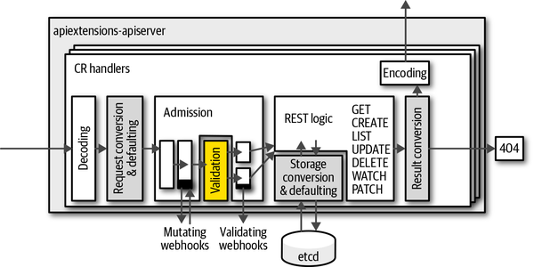

## 一、基本概念
# 1、名词解释
- **API Server**：在 Kubernetes 中，API 服务器（API Server）是 Kubernetes 系统的核心组件之一，负责管理和公开 Kubernetes 集群中的 API。API 服务器提供了一组 RESTful API，用于管理和操作 Kubernetes 集群的各种资源，包括 Pods、Deployments、Services、ConfigMaps等。

  - 理解：

    - API Server相当于k8s集群的前端接口来处理外部请求，可以将对应的如 kubectl 命令行工具的命令转成内部的操作

    - CRD的定义个人理解像是新加了一条Api接口，保证可以通过API Server对CR资源进行操作（通过Restful方式）

图1 Api扩展-ApiServer

- **CRD（Custom Resource Definition）**：允许用户自定义 Kubernetes 资源，是一个类型；

- **CR （Custom Resourse）**：CRD 的一个具体实例；

- **Webhook**：它本质上是一种 Http 回调，会注册到 API Server 上。在 API Server 特定事件发生时，会查询已注册的 webhook，并把相应的消息转发过去。按照处理类型的不同，一般可以将其分为两类：一类可能会修改传入对象，称为 mutating webhook；一类则会只读传入对象（会进行校验），称为 validating webhook；

- **工作队列**：controller 的核心组件。它会监控集群内的资源变化，并把相关的对象，包括它的动作与 key，例如 Pod 的一个 Create 动作，作为一个事件存储于该队列中；

- **controller**：它会循环地处理上述工作队列，按照各自的逻辑把集群状态向预期状态推动。不同的 controller 处理的类型不同，比如 replicaset controller 关注的是副本数，会处理一些 Pod 相关的事件；

  - 监视资源的 创建 / 更新 / 删除 事件，并触发 Reconcile函数作为响应。整个调整过程被称作 Reconcile Loop(协调一致的循环)，其实就是让 POD 趋向CRD定义所需的状态；

- **operator**：operator 是描述、部署和管理 kubernetes 应用的一套机制，从实现上来说，可以将其理解为 CRD 配合可选的 webhook 与 controller 来实现用户业务逻辑，即 operator = CRD + webhook + controller。

2、Controller
- 参考：[链接](https://www.zhaohuabing.com/post/2023-03-09-how-to-create-a-k8s-controller/)

- 定义

  - 在 K8s 中，用户通过声明式 API 定义资源的“预期状态”，Controller 则负责监视资源的实际状态，当资源的实际状态和“预期状态”不一致时，Controller 则对系统进行必要的更改，以确保两者一致，这个过程被称之为调谐（Reconcile）。

- Controller和Operator的区别

  - 有时候 Controller 也被叫做 Operator。这两个术语的混用有时让人感到迷惑。Controller 是一个通用的术语，凡是遵循 “Watch K8s 资源并根据资源变化进行调谐” 模式的控制程序都可以叫做 Controller。而 Operator 是一种专用的 Controller，用于在 Kubernetes 中管理一些复杂的，有状态的应用程序。例如在 Kubernetes 中管理 MySQL 数据库的 MySQL Operator。

K8s HTTP API 的 List Watch 机制

在访问API Server URL 后面加上参数 ?watch=true，则 API Server 会对 default namespace 下面的 pod 的状态进行持续监控，并在 pod 状态发生变化时通过 chunked Response (HTTP 1.1) 或者 Server Push（HTTP2）通知到客户端。K8s 称此机制为 watch。

实践

启动api server代理服务器：kubectl proxy --port 8080，通过 curl 来 List pod 资源

在请求中加上 watch 参数：curl http://localhost:8080/api/v1/namespaces/default/pods?watch=true&resourceVersion=770715

返回

