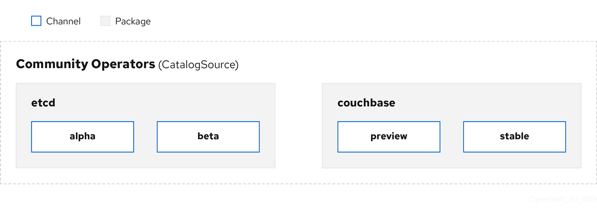
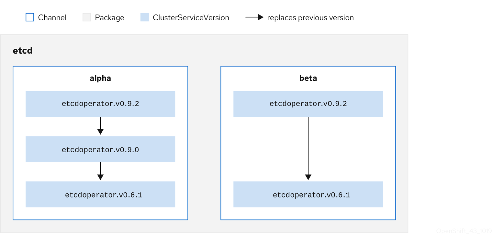

# 1 OLM 
## 1.1 OLM工作流和架构
### 1.1.1 OLM概述
在 OpenShift Container Platform 4.2 中，Operator Lifecycle Manager (OLM) 可帮助用户安装、更新和管理所有 Operator 以及在用户集群中运行的关联服务的生命周期。Operator Lifecycle Manager 是 Operator Framework 的一部分，后者是一个开源工具包，用于以有效、自动化且可扩展的方式管理 Kubernetes 原生应用程序 (Operator)。


### 1.1.2. ClusterServiceVersions (CSV)
ClusterServiceVersion (CSV) 是一个利用 Operator 元数据创建的 YAML 清单，可辅助 Operator Lifecycle Manager (OLM) 在集群中运行 Operator。

CSV 是 Operator 容器镜像附带的元数据，用于在用户界面填充徽标、描述和版本等信息。此外，CSV 还是运行 Operator 所需的技术信息来源，类似于其需要的 RBAC 规则及其管理或依赖的自定义资源 (CR)。

CSV 包含以下内容：

元数据
应用程序元数据：

名称、描述、版本（符合 semver）、链接、标签、图标等。
安装策略
类型：部署

服务账户和所需权限集
部署集。
CRD
类型
自有：由该服务管理
必需：集群中必须存在，该服务才可运行
资源：Operator 与之交互的资源列表
描述符：注解 CRD 规格和状态字段以提供语义信息
### 1.1.3. OLM 中的 Operator 安装和升级工作流
在 Operator Lifecycle Manager (OLM) 生态系统中，以下资源用于解决 Operator 的安装和升级问题：

ClusterServiceVersion (CSV)
CatalogSource
Subscription
CSV 中定义的 Operator 元数据可保存在一个名为 CatalogSource 的集合中。CatalogSource 使用 Operator Registry API，OLM 又使用 CatalogSource 来查询是否有可用的 Operator 及已安装 Operator 是否有升级版本。

在 CatalogSource 中，Operator 被整合为更新软件包和更新流，我们称为频道，这应是 OpenShift Container Platform 或其他软件（如 Web 浏览器）在持续发行周期中的常见更新模式。

用户在 Subscription 中的特定 CatalogSource 中指示特定软件包和频道，如 etcd 包及其 alpha 频道。如果订阅了命名空间中尚未安装的软件包，则会安装该软件包的最新 Operator。
- 注意
   - OLM 会刻意避免版本比较，因此给定 catalog → channel → package 路径提供的“latest”或“newest”Operator 不一定是最高版本号。更应将其视为频道的 head 引用，类似 Git 存储库。

例如：

软件包中的频道
``` 
packageName: example
channels:
- name: alpha
  currentCSV: example.v0.1.2
- name: beta
  currentCSV: example.v0.1.3
defaultChannel: alpha
```
为了让 OLM 成功查询更新、给定 CatalogSource、软件包、频道和 CSV，目录必须能够明确无误地返回替换输入 CSV 的单个 CSV。


OLM 组件模型定义
OLM 的出现是为了帮助没有如大数据，云监控等领域知识的用户能够自助式地部署并管理像 etcd、大数据分析或监控服务等复杂的分布式应用。因此从它的设计目标来说，OLM 官方希望实现面向云原生应用提供以下几个方向上的通用管理能力，包括：

生命周期管理：管理 operator 自身以及监控资源模型的升级和生命周期；
服务发现：发现在集群中存在哪些 operator，这些 operators 管理了哪些资源模型以及又有哪些 operators 是可以被安装在集群中的；
打包能力：提供一种标准模式用于 operator 以及依赖组件的分发，安装和升级；
交互能力：在完成了上述能力的标准化后，还需要提供一种规范化的方式（如 CLI）与集群中用户定义的其他云服务进行交互。
上述在设计上的目标可以归结为下面几个方向上的需求：

命名空间部署：operator 和其管理资源模型必须被命名空间限制部署，这也是在多租环境下实现逻辑隔离和使用 RBAC 增强访问控制的必要手段；
使用自定义资源（CR）定义：使用 CR 模型是定义用户和 operator 读写交互的首选方式；同时在一个 operator 中也是通过 CRDs 声明其自身或被其他 operator 管理的资源模型；operator 自身的行为模式配置也应当由 CRD 中的 fields 定义；
依赖解析：operator 在实现上只需要关心自身和其管理资源的打包，而不需关注与运行集群的连接；同时在依赖上使用动态库定义，这里以 vault-operator 为例，其部署的同时需要创建一个 etcd 集群作为其后端存储；这时我们在 vault-operator 中不应该直接包含 etcd operator 对应容器，而是应该通过依赖声明的方法让 OLM 解析对应依赖。为此在 operators 中需要有一套依赖相关的定义规范；
部署的幂等性：依赖解析和资源安装可以重复执行，同时在应用安装过程中的问题是可恢复的；
垃圾收集：原则上尽可能依赖 Kubernetes 原生的垃圾收集能力，在删除 OLM 自身的扩展模型 ClusterService 时需要同时清理其运行中的关联资源；同时需要保证其他 ClusterService 管理的资源不被删除；
支持标签和资源发现。
基于上述设计目标，OLM 在实现中面向 Operator 定义了如下模型和组件。

首先，OLM 自身包含两个 Operator：OLM Operator 和 Catalog Operator。它们分别管理了如下几个 OLM 架构中扩展出的基础 CRD 模型：

1.jpg

在 Operator 安装管理的生命周期中 Deployment，Serviceaccount，RBAC 相关的角色和角色绑定是通过 OLM operator 创建的；Catalog Operator 负责 CRDs 和 CSVs 等资源的创建。

在介绍 OLM 的两个 Operator 之前，我们先来看下 ClusterServiceVersion 的定义，作为 OLM 工作流程中的基本元素，它定义了在 OLM 管理下用户业务应用的元数据和运行时刻信息的集合，包括了：

应用元数据（名称，描述，版本定义，链接，图标，标签等），在下一章的实战示例中我们会看到具体的定义；
安装策略，包括 Operator 安装过程中所需的部署集合和 service accounts，RBAC 角色和绑定等权限集合；
CRDs：包括 CRD 的类型，所属服务，Operator 交互的其他 K8s 原生资源和 spec，status 这些包含了模型语义信息的 fields 字段描述符等。
在对 ClusterServiceVersion 的概念有了基本了解后，我们来看下 OLM Operator。

首先 OLM Operator 的工作会基于 ClusterServiceVersion，一旦 CSV 中声明的依赖资源都已经在目标集群中注册成功，OLM Operator 就会负责去安装这些资源对应的应用实例。注意这里 OLM Operator 并不会去关注 CSV 中声明的依赖资源对应的 CRD 模型的创建注册等工作，这些动作可以由用户的手工 kubectl 操作或是由 Catalog Opetator 来完成。这样的设计也给了用户一个逐步适应 OLM 架构并最终应用起来的熟悉过程。另外，OLM Operator 对依赖资源对应自定义模型的监听可以是全局 all namespaces 的，也可以只限定在指定的 namespace 下。

接着我们来认识一下 Catalog Operator，它主要负责解析 CSV 中声明的依赖资源定义，同时它通过监听 catalog 中安装包对应 channels 的版本定义完成 CSV 对应的版本更新。

用户可以通过创建 Subscription 模型来设置 channel 中所需安装包和更新的拉取源，当一个可用更新被发现时，一个用户对应的 InstallPlan 模型会在相应的 namespace 被创建出来。当然用户也可以手动创建 InstallPlan，InstallPlan 实例中会包含目标 CSV 的定义和相关的 approval 审批策略，Catalog Operator 会创建相应的执行计划去创建 CSV 所需的依赖资源模型。一旦用户完成审批，Catalog Operator 就会创建 InstallPlan 中的相关资源，此时刚才提及的 OLM Operator 关注的依赖资源条件得到满足，CSV 中定义的 Operator 实例会由 OLM Operator 完成创建。

OLM 结构介绍

首先在 Operator Framework 中提供了两个重要的元 Operator 和相应的扩展资源（如上节中介绍的 ClusterServiceVersion，InstallPlan 等），用于进行用户应用 Operator 的生命周期管理。在自定义的 CSV 模型中定义了用户部署 Operator 的各类资源组合，包括 Operator 是如何部署的，Operator 对应管理的自定义资源类型是什么以及使用了哪些 K8s 原生资源等。

在上节的定义中我们也了解到 OLM Operator 在安装对应的 Operator 实例前要求其管理的自定义资源模型已经被注册在目标安装集群中，而这个动作可以来自于集群管理员手动 kubectl 方式的创建，也可以利用 Catalog Operator 完成，Catalog Operator 除了可以完成目标CRD模型的注册，还负责资源模型版本的自动升级工作。其工作流程包括：

保证 CRDs 和 CSVs 模型的 cache 和 index 机制，用于对应模型的版本控制和注册等动作；
监听用户创建的未解析 InstallPlans:
寻找满足依赖条件的 CSV 模型并将其加入到已解析资源中；
将所有被目标 Operator 管理或依赖的 CRD 模型加入到解析资源中；
寻找并管理每种依赖 CRD 对应 CSV 模型；
监听所有被解析的 InstallPlan，在用户审批或自动审批完成后创建所有对应的依赖资源；
监听 CataologSources 和 Subscriptions 模型并基于其变更创建对应的 InstallPlans。
一旦 OLM Operator 监听到 CSV 模板中安装所需依赖资源已经注册或是变更，就会启动应用 Operator 的安装和升级工作，并最终启动 Operator 自身的工作流程，在 Kubernetes 集群中创建和管理对应的自定义资源实例模型。