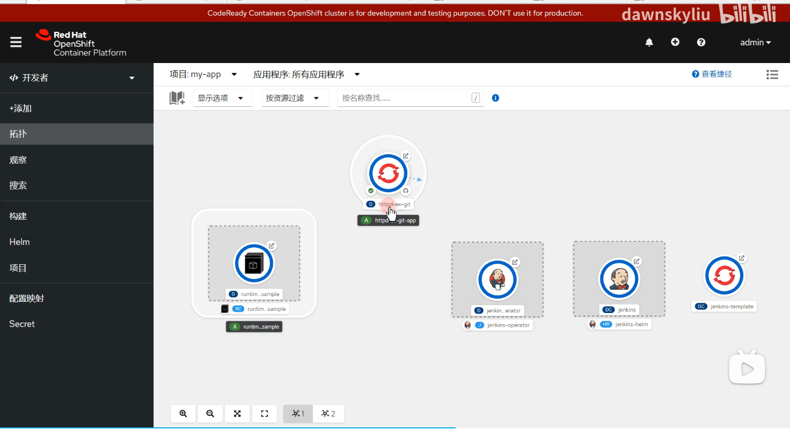
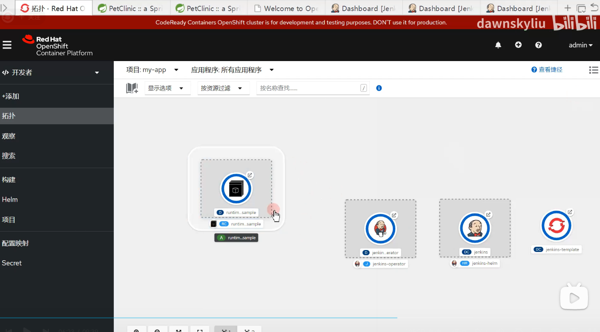

# Openshift Operator
## 1 Operator简介
### 1.1定义
Kubernetes Operator 是一种封装、部署和管理 Kubernetes 应用的方法。
Kubernetes Operator 是一种特定于应用的控制器，可扩展 Kubernetes API 的功能，来代表 Kubernetes 用户创建、配置和管理复杂应用的实例。
Kubernetes Operator 是一种特定于应用的控制器，可扩展 Kubernetes API 的功能，来代表 Kubernetes 用户创建、配置和管理复杂应用的实例。

它基于基本 Kubernetes 资源和控制器概念构建，但又涵盖了特定于域或应用的知识，用于实现其所管理软件的整个生命周期的自动化。 

在 Kubernetes 中，控制平面的控制器实施控制循环，反复比较集群的理想状态和实际状态。如果集群的实际状态与理想状态不符，控制器将采取措施解决此问题。

Operator 是使用自定义资源（CR）管理应用及其组件的自定义 Kubernetes 控制器。高级配置和设置由用户在 CR 中提供。Kubernetes Operator 基于嵌入在 Operator 逻辑中的最佳实践将高级指令转换为低级操作。

自定义资源是 Kubernetes 中的 API 扩展机制。自定义资源定义（CRD）会明确 CR 并列出 Operator 用户可用的所有配置。 

Kubernetes Operator 监视 CR 类型并采取特定于应用的操作，确保当前状态与该资源的理想状态相符。

Kubernetes Operator 通过自定义资源定义引入新的对象类型。Kubernetes API 可以像处理内置对象一样处理自定义资源定义，包括通过 kubectl 交互以及包含在基于角色的访问权限控制（RBAC）策略中。

Kubernetes Operator 会持续监控正在运行的应用，可备份数据，从故障中恢复，以及随着时间的推移自动升级应用。 

Kubernetes Operator 几乎可执行任何操作：扩展复杂的应用，应用版本升级，甚至使用专用硬件管理计算集群中节点的内核模块。

# Openshift

openshift 以下简称osh

## 

即使是同一款软件，osh也提供了不同的部署方式

operator可以通过监控自动化还原配置

operator提供了两种方式去实现operator，左边的方法一成本较高。方法二易用性更强

删除应用的演示
删除普通应用

可以正常删除

删除operator应用

删除后应用自动恢复

所有直接对应用进行的直接修改都会被operator检测到，并且复原到operator中的状态。若想修改，则需要在应用的operator中进行修改
