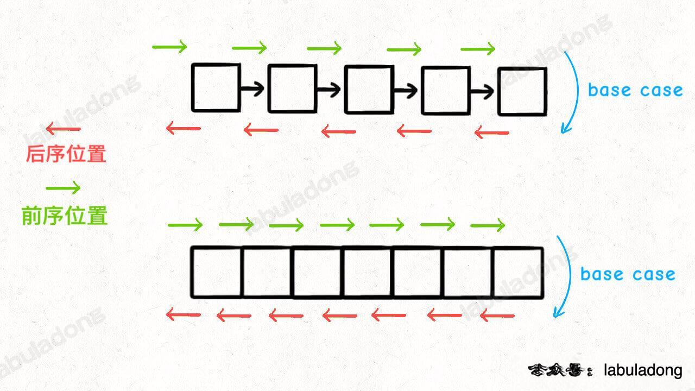
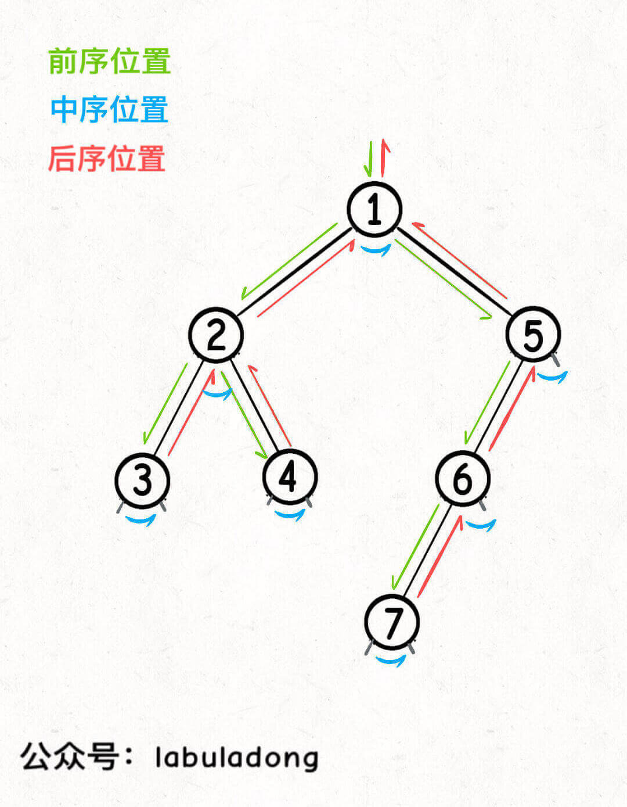
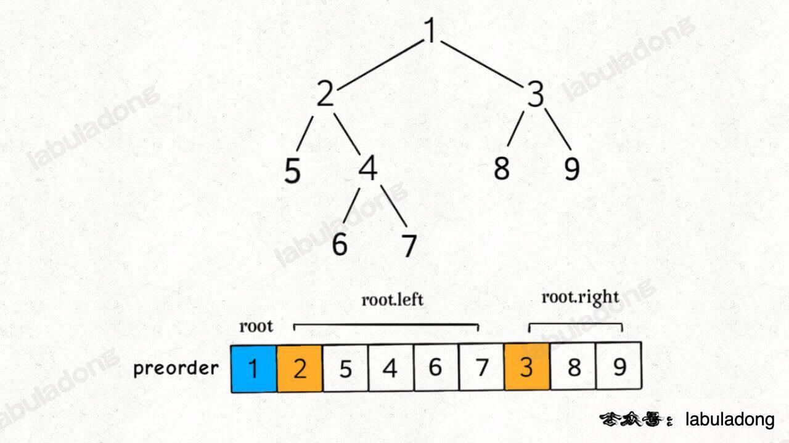

## chapter 0
### 二叉树纲领篇
二叉树两种分类
1. **是否可以通过遍历一遍二叉树得到答案？** 如果可以，用一个traverse函数配合外部变量来实现，这成为遍历的思维模式。
2. **是否可以定义一个递归函数，通过子问题（子树）的答案推导出原问题的答案？** 如果可以，写出这个递归函数的定义，并充分利用这个函数丶返回值，这叫分解问题的思维模式

如果单独抽出一个二叉树节点，它需要做什么事情？需要在什么时候（前/中/后序位置）做？其他的节点不用你操心，递归函数会帮你在所有节点上执行相同的操作。

快排就是二叉树的前序遍历，归并排序就是二叉树的后续遍历
```cpp
// quick sort
void sort(int nums[], int lo, int hi) {
    /****** 前序遍历位置 ******/
    // 通过交换元素构建分界点 p
    int p = partition(nums, lo, hi);
    /************************/

    sort(nums, lo, p - 1);
    sort(nums, p + 1, hi);
}
```
先构造分界点（前序位置），然后去左右子树构造分界点
```cpp
// merge sort

// 定义：排序 nums[lo..hi]
void sort(vector<int>& nums, int lo, int hi) {
    int mid = (lo + hi) / 2;
    // 对 nums[lo..mid] 进行排序
    sort(nums, lo, mid);
    // 对 nums[mid+1..hi] 进行排序
    sort(nums, mid + 1, hi);

    /****** 在后序位置进行归并操作 ******/
    // 合并 nums[lo..mid] 和 nums[mid+1..hi]
    merge(nums, lo, mid, hi);
    /**********************************/
}

```
先对[lo, mid],[mid+1, hi]进行排序，在后续位置合并数组，分治算法也是同样的思想
**所谓前序位置，就是刚进入一个节点（元素）的时候，后序位置就是即将离开一个节点（元素）的时候**

前中后序是遍历二叉树过程中处理每一个节点的三个特殊时间点，绝不仅仅是三个顺序不同的 List：

**前序位置的代码在刚刚进入一个二叉树节点的时候执行；**

**后序位置的代码在将要离开一个二叉树节点的时候执行；**

**中序位置的代码在一个二叉树节点左子树都遍历完，即将开始遍历右子树的时候执行。**


你可以发现每个节点都有「唯一」属于自己的前中后序位置。
二叉树的所有问题，就是让你在前中后序位置注入巧妙的代码逻辑，去达到自己的目的，你只需要单独思考每一个节点应该做什么，其他的不用你管，抛给二叉树遍历框架，递归会在所有节点上做相同的操作。

二叉树题目的递归解法可以分两类思路，第一类是遍历一遍二叉树得出答案，第二类是通过分解问题计算出答案，这两类思路分别对应着 回溯算法核心框架 和 动态规划核心框架。

Tip

这里说一下我的函数命名习惯：二叉树中用遍历思路解题时函数签名一般是 `void traverse(...)`，没有返回值，靠更新外部变量来计算结果，而用分解问题思路解题时函数名根据该函数具体功能而定，而且一般会有返回值，返回值是子问题的计算结果。

与此对应的，你会发现我在 回溯算法核心框架 中给出的函数签名一般也是没有返回值的`void backtrack(...)`，而在 动态规划核心框架 中给出的函数签名是带有返回值的 dp 函数。这也说明它俩和二叉树之间千丝万缕的联系。

虽然函数命名没有什么硬性的要求，但我还是建议你也遵循我的这种风格，这样更能突出函数的作用和解题的思维模式，便于你自己理解和运用。


前序遍历结果，**一棵二叉树的前序遍历结果 = 根节点 + 左子树的前序遍历 +右子树的前序遍历结果。**

```cpp
// 定义：输入一棵二叉树的根节点，返回这棵树的前序遍历结果
vector<int> preorderTraverse(TreeNode* root) {
    vector<int> res;
    if (root == nullptr) {
        return res;
    }
    // 前序遍历的结果，root->val 在第一个
    res.push_back(root->val);
    // 利用函数定义，后面接着左子树的前序遍历结果
    vector<int> leftRes = preorderTraverse(root->left);
    res.insert(res.end(), leftRes.begin(), leftRes.end());
    // 利用函数定义，最后接着右子树的前序遍历结果
    vector<int> rightRes = preorderTraverse(root->right);
    res.insert(res.end(), rightRes.begin(), rightRes.end());
    return res;
}
```
中序和后序其实也是类似的实现。

综上，遇到一道二叉树的题目时的通用思考过程是：

**1、是否可以通过遍历一遍二叉树得到答案？如果可以，用一个 traverse 函数配合外部变量来实现。**

**2、是否可以定义一个递归函数，通过子问题（子树）的答案推导出原问题的答案？如果可以，写出这个递归函数的定义，并充分利用这个函数的返回值。**

**3、无论使用哪一种思维模式，你都要明白二叉树的每一个节点需要做什么，需要在什么时候（前中后序）做。**
#### 序列位置的特殊之处
**前序位置的代码执行是自顶向下的，而后序位置的代码执行是自底向上的。**

**但这里面大有玄妙，意味着前序位置的代码只能从函数参数中获取父节点传递来的数据，而后序位置的代码不仅可以获取参数数据，还可以获取到子树通过函数返回值传递回来的数据。**
举具体的例子，现在给你一棵二叉树，我问你两个简单的问题：

1、如果把根节点看做第 1 层，如何打印出每一个节点所在的层数？

2、如何打印出每个节点的左右子树各有多少节点？
q1.
```cpp
// 二叉树遍历函数
void traverse(TreeNode* root, int level) {
    if (root == NULL) {
        return;
    }
    // 前序位置
    printf("节点 %s 在第 %d 层", root, level);
    traverse(root->left, level + 1);
    traverse(root->right, level + 1);
}

// 这样调用
traverse(root, 1);

```
q2
```cpp
// 定义：输入一棵二叉树，返回这棵二叉树的节点总数
int count(TreeNode* root) {
    if (root == nullptr) {
        return 0;
    }
    int leftCount = count(root->left);
    int rightCount = count(root->right);
    // 后序位置
    printf("节点 %s 的左子树有 %d 个节点，右子树有 %d 个节点",
            root->val, leftCount, rightCount);

    return leftCount + rightCount + 1;
}

```
**这两个问题的根本区别在于：一个节点在第几层，你从根节点遍历过来的过程就能顺带记录，用递归函数的参数就能传递下去；而以一个节点为根的整棵子树有多少个节点，你需要遍历完子树之后才能数清楚，然后通过递归函数的返回值拿到答案。**

结合这两个简单的问题，你品味一下后序位置的特点，只有后序位置才能通过返回值获取子树的信息。

那么换句话说，一旦你发现题目和子树有关，那大概率要给函数设置合理的定义和返回值，在后序位置写代码了。