## Chapter 2
### Introduction
Overflow example: the expression $200*300*400*500$ yields  −884,901,888.
$  (500  *  400) * (300 * 200)
   ((500 *  400) * 300) * 200
   ((200 *  500) * 300) * 400
   400   * (200 * (300 * 500))$
The computer may not generate the expected result, but at least it is consistent.
### 2.1 Information Storage
Most computer use blocks of 8 bits, or bytes, as the smallest addressable unit of memory.
##### Aside
GNU Compiler Collection(GCC)
`linux > gcc -std=11 prog.c`
#### 2.1.1 Hexadecimal Notation

#### 2.1.2 Data Sizes
 
#### 2.1.3 Addressing and Byte Order
For example, suppose a variable x of type int has address 0x100; that is, the value of the address expression &x is 0x100. Then (assuming data type int has a 32-bit representation) the 4 bytes of x would be stored in memory locations 0x100, 0x101, 0x102, and 0x103.
Suppose the variable x of type int and at address 0x100 has a hexadecimal value of 0x01234567. The ordering of the bytes within the address range 0)x100 through 0x103 depends on the type of machine:

Little-Endian:
- Most Intel-compatible machines 
- Android and IOS
Big-Endian:
- most machines from IBM and Oracle 
```c
#include <stdio.h>
typedef unsigned char *byte_pointer;
void show_bytes(byte_pointer start, size_t len) {
    int i;
for (i=0;i<len;i++) printf(" %.2x", start[i]);
    printf("\n");
}
void show_int(int x) {
    show_bytes((byte_pointer) &x, sizeof(int));
}
void show_float(float x) {
    show_bytes((byte_pointer) &x, sizeof(float));
}
void show_pointer(void *x) {
    show_bytes((byte_pointer) &x, sizeof(void *));
}
/*In "0x%2x" the 2 defines the "fieldwidth": if the hex representation of the value consists of less than 2 digits, it is prefixed with spaces to end up with a fieldwidth of 2.

In "0x%.2x" the 2 defines the precision: there will be at least 2 hex digits in the result, if the representation of the value has less digits, it is prefixed with 0's

Some examples (using 4 as width, for clarity):
Printf("0x%4x",12) "0x C"
Printf("0x%.2x",12) "0x0C"
Printf("0x%4.2x",12) "0x 0C"
Printf("0x%04x",12) "0x000C"*/
void test_show_bytes(int val) {
    int ival = val;
    float fval = (float) ival;
    int *pval = &ival;
    show_int(ival);
    show_float(fval);
    show_pointer(pval);
}
```


##### Practice Problem 2.5
Consider the following three calls to show_bytes:
```c
    int a = 0x12345678;
    byte_pointer ap = (byte_pointer) &a;
    show_bytes(ap, 1); /* A. */
    show_bytes(ap, 2); /* B. */
    show_bytes(ap, 3); /* C. */
```
Indicate the values that will be printed by each call on a little-endian machine and on a big-endian machine:
A. Little endian: 78    Big endian: 12
B. Little endian: 78 56 Big endian: 12 34
C. Little endian: 78 56 34 Big endian:12 34 56

##### Practice Problem 2.7
What would be printed as a result of the following call to show_bytes?
`
const char*m = "mnopqr";
show_bytes((byte_pointer)m, strlen(m));
`
6D 6E 6F 70 71 72
#### 2.1.5 Representing Code
#### 2.1.6 Introduction to Boolean Algebra
#### 2.1.7 Bit-Level Operations in C
##### Practice Problem 2.10
As an application of the property that a ^ a = 0 for any bit vector a, consider the following program:
```c
void inplace_swap(int *x, int *y) { 
    *y=*x^*y; /*Step1*/
    *x=*x^*y; /*Step2*/
    *y=*x^*y; /*Step3*/
}
```
|Step|*x|*y|
|----|----|----|
|Initially|a|b|
|Step1|a|a^b|
|Step2|b|a^b|
|Step3|b|a|
##### Practice Problem 2.11
x = 0x87654321, The C expression 
All but the least significant byte of x complemented, with the least significant byte left unchanged.[0x789ABC21]
x ^ ~0xFF
##### Practice Problem 2.13
The Digital Equipment VAX computer was a very popular machine from the late 1970s until the late 1980s. Rather than instructions for Boolean operations and and or, it had instructions bis (bit set) and bic (bit clear). Both instructions take a data word x and a mask word m. They generate a result z consisting of the bits of x modified according to the bits of m. With bis, the modification involves setting z to 1 at each bit position where m is 1. With bic, the modification involves setting z to 0 at each bit position where m is 1.
To see how these operations relate to the C bit-level operations, assume we have functions bis and bic implementing the bit set and bit clear operations, and that we want to use these to implement functions computing bitwise operations | and ^, without using any other C operations. Fill in the missing code below. Hint: Write C expressions for the operations bis and bic
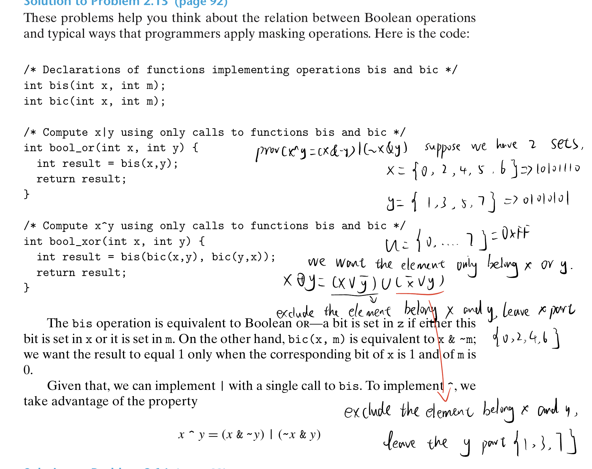
#### 2.1.8 Logical Operations in C
==A important distinction between the logical operators '&&' and '||' versus their bit-level
counterparts '&' and '|' is that the logical operators do not evaluate their second argument if the result of the expression can be determined by evaluating the first argument.
##### Practice Problem 2.14
Suppose that a and b have byte values 0x55 and 0x46, respectively. Fill in the following table indicating the byte values of the different C expressions:
|Expression|Value|Expression|Value|
|----|----|----|----|
|a&b|0x44|a&&b|1|
|a\|b|0x57|a||b|1|
|~a|~b|0xBB|!a\|\|!b|0|
|a&!b|0x00|a&&~b|1|
##### Practice Problem 2.15
Using only bit-level and logical operations, write a C expression that is equivalent to x == y. In other words, it will return 1 when x and y are equal and 0 otherwise.
x^y
#### 2.1.9 Shift Operations in C
Two forms of right shift: x >> k
- Logical. A logical right shift fills the left end with k zeros, giving a result $[0,...,x_{w-1},x{w-2},... x_k]$
- Arithmetic. An arithmetic right right shift fills the left end with k repetitions of the most significant bit, giving a result $[x_{w-1},...,x_{w-1},x{w-2},... x_k]$.

|Operations|Value 1|Value 2|
|----|----|----|
|Argument x|[01100011]|[10010101]|
|x<<4|[00110000]|[01010000]|
|x>>4(logical)|[00000110]|[00001001]|
|x>>4(arithmetic)|[00000110]|[11111001]|
In practice, almost all compiler/machine combinations use arithmetic right shifts for signed data, and many programmers assume this to be the case. For unsigned data, on the other hand, right shifts must be logical.
Java: x>>k (arithmetic) x>>>k(logical)

### 2.2 Integer Representations

#### 2.2.1 Integral Data Types

#### 2.2.2 Unsigned Encodings
We write a bit vector as either $\vec{x}$, to denote the entire vector, or as $[x_{w-1},x{w-2},... x_0]$

Principle: Uniqueness of unsigned encoding
Function $B2U_w$ is a bijection
The mathematical term bijection refers to a function f that goes two ways: it maps a value x to a value y where y = f (x), but it can also operate in reverse, since for every y, there is a unique value x such that f (x) = y. This is given by the inverse function f −1, where, for our example, x = f −1(y ). The function $B2U_w$ maps each bit vector of length w to a unique number between 0 and 2w − 1, and it has an inverse, which we call $U2B_w $(for “unsigned to binary”), that maps each number in the range 0 to 2w − 1 to a unique pattern of w bits.
#### 2.2.3 Two's Complement Encodings
*Two's-complement* form is defined by interpreting the most significant bit of the word to have negative weight.We express this expression as a function $B2T_w$.(for "binary to two's complement" length w)


w-bit two's complement number.
- The least value is given by bit vector$[10\dots0]$, having integer value $TMin_w = -2^{w-1}$.
- The greatest value is given by bit vector $[01\dots1]$, having integer value $TMax_w=\Sigma_{i=0}^{w-2}2^i=2^{w-1}-1$
Principle: Uniqueness of two's complement encoding. Function $B2T_w$ is a bijection.
We define function $T2B_w$ (for"two's complement to binary") to be inverse of $B2T_w$. That is, for a number x, such that 


## Chapter 3 
### 3.2程序编码
```
gcc -Og -o p p1.c p2.c
```
&emsp;编译选项Og告诉编译器使用生成符合原始C代码的整体结构的机器代码的优化等级。从得到的程序性能考虑，较高级别的优化（例如O1 O2）可能是更好的选择。
&emsp; gcc处理过程，首先插入##include指定的文件，扩展##define声明的宏。其次编译器产生两个源文件的汇编代码p1.s,p2.s，汇编器把汇编代码转化成二进制目标代码文件p1.o,p2.o。（此时还未填入全局值地址）。最后链接七将两个目标代码文件与实现的库函数代码合并，最终产生可执行文件（由-o p指定）。
##### 3.2.1 机器级代码
两种重要抽象
- 指令集体系结构或者指令集结构(Instruction Set Architecture, ISA)定义了处理状态、指令格式，每条指令对状态的影响
- 虚拟地址抽象，提供的内存模型看上去是一个很大字节数组
&emsp;汇编代码接近于机器代码，但有更好可读性
- 程序计数器（PC，x86-64中%rip）给出下一条指令的内存地址
- 整数寄存器包含16个命名位置，分别存64位值得，可存地址（C语言中指针）或整数数据。部分用于记录重要程序状态，其他用于保存临时数据，比如过程参数，局部变量，函数返回值
- 条件码寄存器包存最近执行的算术逻辑或逻辑指令的状态信息，实现条件变化，比如if，while
- 一组向量寄存器存放一个或多个整数或浮点数值
汇编代码不区分有无符号，不区分指针类型，甚至不区分整数和指针
程序内存包含：程序的可执行机器代码，管理过程调用和返回的运行时栈，用户分配的内存块（malloc库函数）。给定时刻，只有有限的部分虚拟地址被认为是合法的。例如，x86-64中虚拟地址是64位字表示，目前要求前16位设0，所以能访问的地址只有$2^{48}$或64TB//想不通；；范围内的一个字节。操作系统负责管理虚拟地址空间，将虚拟地址翻译成世纪处理器内存中的物理地址。一条机器指令只执行一个非常基本的操作，例如，将存在寄存器中的两个数字相加，在存储器和寄存器之间传送数据，条件分支转移到新的指令地址。编译器必须产生这些指令的序列，实现程序结构。
不同版本的gcc可能会产生不同的代码
##### 3.2.2 代码示例
mstore.c
```c
long mult2(long, long);

void multstore(long x, long y, long *dest){
    long t = mult2(x, y);
    *dest = t;
}
```
调用-S的到编译器产生的汇编代码
```
gcc -Og -S mstore.c
```
汇编代码
```
    pushq   %rbx // 将寄存器%rbx内容压栈
    movq    %rdx, %rbx
    call    mult2
    movq    %rax, (%rbx)
    popq    %rbx
    ret
```
-c 会编译并汇编该代码，生成二进制mstore.o,包含着各种数字代码指令
```
gcc -Og -c mstore.c
```
反汇编器(disassembler)机器代码 >> 汇编代码，-d， OBJDUMP(object dump)
```
objdump -d mstore.o
```
机器代码以及反汇编特性注意点
- x86-64指令长度从1-15字节不等，常用的指令以及操作数较少的指令所需字节数少，不常用活着操作数较多的指令字节数多
- 汇编指令中的结尾q多数情况不影响
&emsp;生成可执行代码需要对目标代码运行链接器，这一组目标代码文件中必须含有一个main函数。假设main.c如下
```c
##include <stdio.h>

void multstore(long, long, long* );

int main(){
    long d;
    multstore(2, 3, &d);
    printf("2 * 3 --> %ld\n", d);
    return 0;
}
long mult2(long a, long b){
    long s = a*b;
    return s;
}
```
感觉不是很重要，如有需要详细看书p117，g148
##### 3.2.3 关于格式注解
```
gcc -Og -S mstore.c
```
```
	.section	__TEXT,__text,regular,pure_instructions
	.build_version macos, 12, 0	sdk_version 12, 3
	.globl	_multstore                      ; -- Begin function multstore
	.p2align	2
_multstore:                             ; @multstore
	.cfi_startproc
; %bb.0:
	stp	x20, x19, [sp, ##-32]!           ; 16-byte Folded Spill
	stp	x29, x30, [sp, ##16]             ; 16-byte Folded Spill
	add	x29, sp, ##16
	.cfi_def_cfa w29, 16
	.cfi_offset w30, -8
	.cfi_offset w29, -16
	.cfi_offset w19, -24
	.cfi_offset w20, -32
	mov	x19, x2
	bl	_mult2
	str	x0, [x19]
	ldp	x29, x30, [sp, ##16]             ; 16-byte Folded Reload
	ldp	x20, x19, [sp], ##32             ; 16-byte Folded Reload
	ret
	.cfi_endproc
                                        ; -- End function
.subsections_via_symbols
```
‘.‘开头的指令都是知道汇编器和链接器工作的伪指令，通常可以忽略。

```cpp
void mulstore(long x, long y, long *dest)
x in %rdi, y in %rsi, dest in %rdx
```
```
1 multstore:
    pushq   %rbx    //  Save %rbx
    movq    %rdx, %rbx  // Copy dest to %rbx
    call    mult2   // Call mult2(x, y)
    movq    %rax, (%rbx)    // Store result at *dest
    popq    %rbx    // Restore %rbx
    ret             //Return
```
#### 3.3数据格式
8  bit = "byte"
16 bit = "word" = "2 byte"
32 bit = "double words"
64 bit = "quad words"
| C声明 |Intel数据类型 | 汇编代码后缀 |大小（字节）|
| ---- | ---- | ---- |----|
|char| 字节| b| 1 |
|short|字|w|2|
|int|双字|l|4|
|long|四字|q|8|
|char*|四字|q|8|
|float|单精度|s|4|
|double|双精度|l|8|
movb,传送字节，movw，传送字，movl，传送双字，movq，传送四字
### 3.4 Accessing Information 访问信息
&emsp;一个x86-64 cpu包含一组16个存储64位值的==通用目的寄存器==。（存储整数数据和指针）
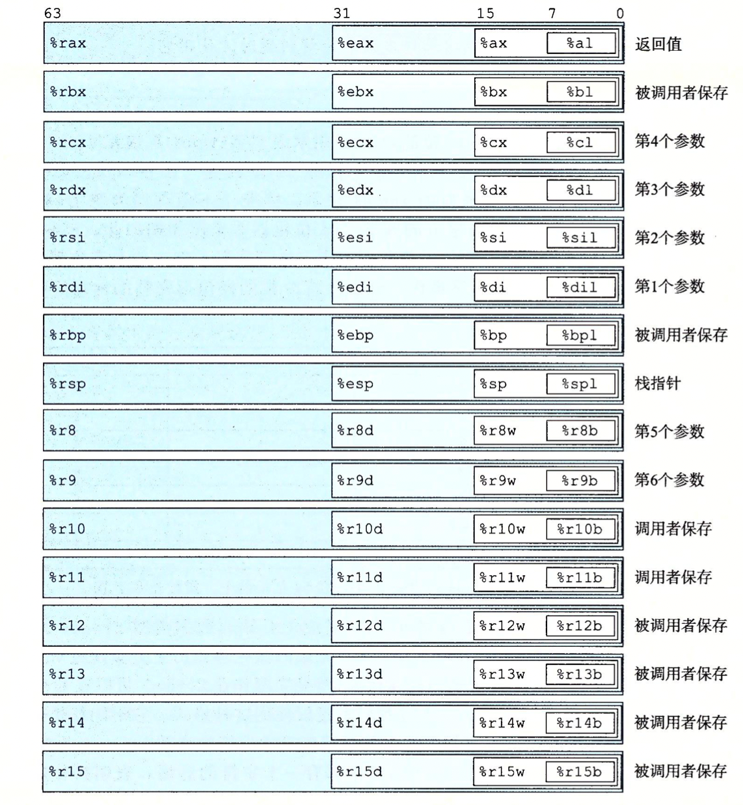
字节级操作访问最低的字节，16位操作访问最低的2个字节，32位操作访问最低的4个字节，64位操作访问整个寄存器
当指令以寄存器位目标，对于生成小于8字节结果的指令，寄存器中剩余字节变化规则1.生成1，2字节的数字的指令会保持剩下的字节不变；2.生成4字节数字的指令会把高位4个字节置0
栈指针%rsp用来指明运行时栈的结束位置，其余有更灵活的运用
#### 3.4.1 Operand Specifiers 操作指示符
&emsp;大多数指令有一或多个操作数(operand)
- 立即数 书写方式 ‘$’后跟一个整数
- 寄存器 表示某个寄存器都内容，16个寄存器低位1字节，2字节，4字节或者8字节中的一个座位操作数，对应8，16，32，64位
- 内存引用
&emsp; 
- ==Immediate== is for constant values. In ATT-format assembly code, these are written with a '\$' followed by an interger. e.g \$0x108
- ==Register== denotes the contents of a register. In following figure, we use $r_a$ to denote an arbitary register a and indicate its value with the reference $R[r_a]$.
- ==Memory reference==, In following figure, we use $M_b[Addr]$ to denote a reference to the b-byte value stored in memory address Addr.
The most general form is shown at the bottom fo the table with syntax $Imm(r_a, r_i, s)$.Such a reference have four components: an immediate offset $Imm$, a base register $r_b$, an index register $r_i$, and a scale factor s, where ==s must be 1, 2, 4, or 8.== The effective address is computed as $Imm+R[r_b]+R[r_i]\cdot s$.
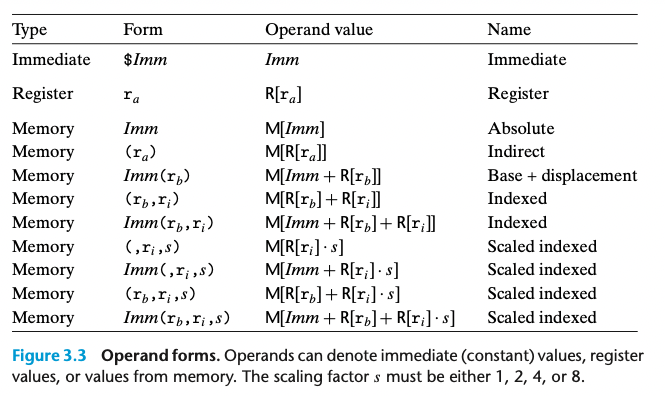
######## Practice Problem 3.1
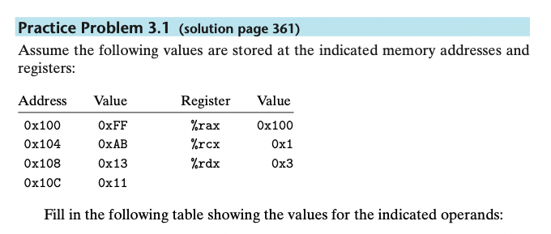
|Operand|Value| |
|----|----|----|
|%rax|0x100|Register|
|0x104|0xAB|Absolute address|
|$0x108|0x108|Immediate|
|(%rax)|0xFF|Address 0x100|
|4(%rax)|0xAB|4+0x100=0x104, the memory address|
|9(%rax, %rdx)|0x11|0x100+0x3+9=0x10C,m addr|
|260(%rcx,%rdx)|0x13|0x1+0x3+260(0x104) = 0x108|
|0xFC(,%rcx,4)|0xFF|0xFC+4*0x1=0x100|
|(%rax,%rdx,4)|0x11|0x100+0x3*4=0x10C|
###### 3.4.2 Data Movement Instructions
&emsp; copy data from one location to another.
&emsp; In our presentation, we group the many different instructions into *instruction  classes*, where the instructions in a class perform the same operation but with different operand sizes.
&emsp; Figure 3.4 lists the MOV class. These instructions copy data form a source location to a destination location. The class consists of four instructions: movb, movw, movl, and movq. The differ primarily in that the operate on data of different sizes: 1, 2, 4, and 8 bytes, respectively.
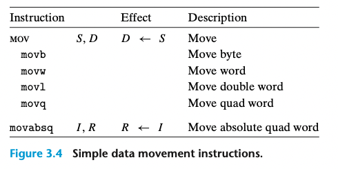
&emsp; The source operand designates a value that is immediate, stored in a register, or stored in memory.The destination operand designates a location that is either a register or memory address.x86-64 imposes the restriction that a move instruction cannot have both operands refer to memory locations.Copying a value from one memory location to another need two instructions, the first to load it into a register, and the second to write this register value to the destination.The size of the register must match the size designated by the last character of the instruction('b','w','l', or'q').For most cases, the MOV instructions will only update the specific register bytes or memory locations indicated by th destination operand.*Exception: when movl has a register as the destination, it will also set the high-order 4 bytes of the register to 0.(x86-64) Any instruction that generates a 32-bit value for a register also sets the high-order portion of the register to 0.*
&emsp;The movabsq instruction can have an arbitrary 64-bit immediate value as its source operand and can only have a register as a destination.
==The regular movq instruction can only have immediate source operands that can be represented as 32-bit two’s-complement numbers.== cannot understand
```
1   movl $0x4050, %eax Immediate--Register, 4 bytes
2   movw %bp, %sp      Register--Register, 2 bytes
3   movb (%rdi, %rcx), %al  Memory--Register, 1 bytes
4   movb $-17, (%esp)  Immediate--Memory, 1 byte
5   movq %rax, -12(%rbp) Immediate--Memory, 8 bytes
```
######## Aside
```
1 movabsq $0x0011223344556677, %rax %rax = 0011223344556677
2 movb    $-1, %al  %rax = 00112233445566FF
3 movw    $-1, %ax  %rax = 001122334455FFFF
4 movl    $-1, %eax %rax = 00000000FFFFFFFF
5 movq    $-1, %rax %rax = FFFFFFFFFFFFFFFF
```
Fig 3.5 and 3.6 document two classes of data movement instructions for use when copying a smaller source value to a larger destination.All of these instructions copy data from a source, which can be either a register or stored in memory, to a register destination.Instructions in the ==MOVZ== fill out the remaining bytes of the destination with ==zeros==, while those int the ==MOVS== class fill them out by significant bit of the source operand.
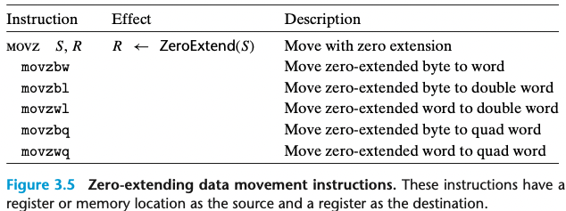
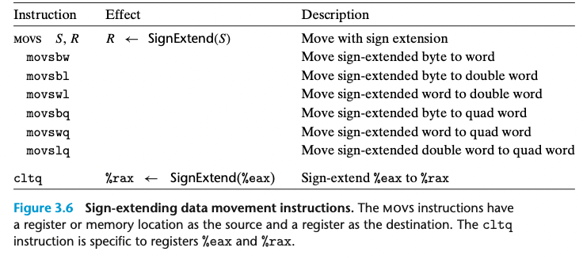
&emsp;movzlq does not exist. Instead, this type of movement can be implemented using a movl instruction having the register as the destination.
&emsp; cltq instruction always uses register %eax as its source and %rax as the destination for the sign-extended result.
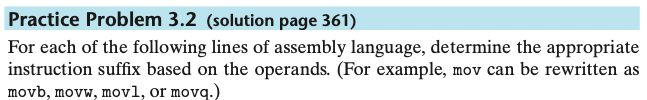
```
movl    %eax,   (%rsp)
movw    (%rax), %dx
movb    $0xFF,  %bl
movb    (%rsp,%rdx,4),  %dl
movq    (%rdx), %rax
movw    %dx,    (%rdx)
```
######## Aside 
```
1   movabsq $0x0011223344556677,    %rax    %rax = 0x0011223344556677
2   movb    $0xAA,  %dl     %dl = AA
3   movb    %dl,    %al     %rax = 0x00112233445566AA
4   movsbq  %dl,    %rax    %rax = FFFFFFFFFFFFFFAA
5   movzbq  %dl,    %rax    %rax = 00000000000000AA
```
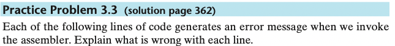
```
movb $OxF, (%ebx)  | Cannot use %ebx as address register
movl %rax, (%rsp) | movq %rax, (%rsp)
movw (%rax), 4(%rsp)| movq (%rax), %rdi ; movq %rdi 4(%rsp)
movb %al, %sl|  No register named %sl
movq %rax, $0x123 | the destination is immediate, which should be memory address
movl %eax, %dx | Destination operand incorrect size 
movb %si, 8(%rbp)|
```
##### 3.4.3 Data Movement Example
&emsp; A function returns a value by storing it in register %rax, or in one of the low-order portions of this register.
(a) C code
```c
long exchange(long *xp, long y){
    long x = *xp;
    *xp = y;
    return x;
}
```
(b) Assembly code
```
long exchange(long *xp, long y)
xp in %rdi, y in %rsi
1 exchange:
2   movq (%rdi), %rax    Get x at xp. Set as return value.
3   movq %rsi, (%rdi)   Store y at xp.
4   ret                 Return.
```
&emsp;Two features about this assembly code are worth noting. First, we see that what we call “pointers” in C are simply addresses. Dereferencing a pointer involves copying that pointer into a register, and then using this register in a memory reference. Second, local variables such as x are often kept in registers rather than stored in memory locations. ==Register access is much faster than memory access.==

###### Practice Problem 3.4 
Assume variables sp and dp are declared with types 
```c
src_t *sp;
dest_t *dp;
```
where src_t and dest_t are data types declared with typedef. We wish to use
the appropriate pair of data movement instructions to implement the operation
```c
 *dp = (dest_t) *sp;
```
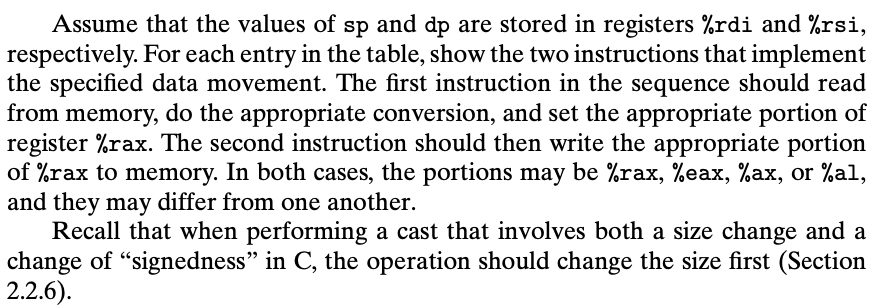
|src_t|dest_t|Instruction|Comments|
|----|----|----|----|
|long|long|movq(%rdi),%rax ; movq %rax, (%rsi)|Read 8 bytes, Store 8 bytes|
|char|int|movsbl (%rdi), %eax ; movl %eax, (%rsi)|Convert char to int, Store 4 bytes|
|char|unsigned|movsbl (%rdi), %eax ; movl %eax, (%rsi)|Convert char to int, Store 4 bytes|
|unsigned char|long|movzbl (%rdi), %eax ; movq %rax, (%rsi)|Read byte and zero-extend, Store 8 bytes|
|int|char|movl (%rdi), %eax; movb %al, (%rsi)|Read 4 bytes, Store low-order byte|
|unsigned|unsigned char|movl (%rdi), %al ; movb %al, (%rsi)|Read 4 bytes, Store low-order byte|
|char|short|movsbw (%rdi), %ax ; movw %ax, (%rsi)|Read byte and sign-extend, Store 2 bytes|

Q:why use extend mov?  
A: Take char -> int as example, the int have 4 bytes, so u need to fill out the empty bits.
Note: 
1. unsigned->any type use MOVS(if size enlarge)
2. signed->any type use MOVZ (if size enlarge)
########  Practice Problem 3.5 
You are given the following information. A function with prototype
```c
void decode1(long *xp, long *yp, long *zp);
```
is compiled into assembly code, yielding the following:
```
  void decode1(long *xp, long *yp, long *zp)
  xp in %rdi, yp in %rsi, zp in %rdx
decode1:
  movq    (%rdi), %r8
  movq    (%rsi), %rcx
  movq    (%rdx), %rax
  movq    %r8, (%rsi)
  movq    %rcx, (%rdx)
  movq    %rax, (%rdi)
  ret
```
Parameters xp, yp, and zp are stored in registers %rdi, %rsi, and %rdx, respectively.
Write C code for decode1 that will have an effect equivalent to the assembly code shown.
```c
    void decode1(long *xp, long *yp, long *zp{
        long x, y ,z;
        x = *xp;
        y = *yp;
        z = *zp;
        *yp = x;
        *zp = y;
        *xp = z;
    }
```
##### 3.4.4 Pushing and Popping Stack Data
The stack grows downward such that the top element of the stack has the lowest address of all stack elements.(By convention, we draw stacks upside down, with the stack "top" shown at the bottom of the figure.)  
The stack pointer %rsp holds the address of the top stack element.  
Pushing a quad word value onto the stack involves first decrementing the stack pointer by 8 and then writing the value at the new top-of-stack address.(indicate that every address save 1 byte) 
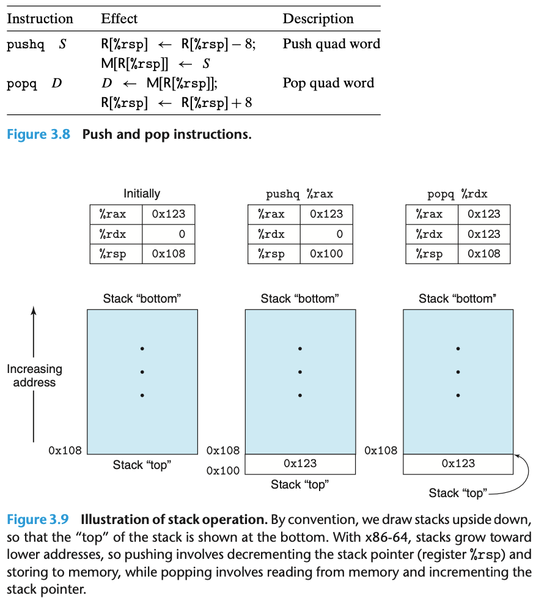 
pushq is equivalent to that of the pair of instructions
```
subq $8,%rsp  
movq %rbp,(%rsp)
```
Since the stack is contained in the same memory as the program code and other forms of program data, programs can access arbitrary positions within the stack using the standard memory addressing methods. For example, assuming the topmost element of the stack is a quad word, the instruction `movq 8(%rsp), %rdx` will copy the second quad word from the stack to register %rdx.
### 3.5 Arithmetic and Logical Operations
Most of the operations are given as instruction classes, as they can have different variants with different operand sizes.(Only leaq has no other size variants.)ADD(addb, addw, addl, addq).
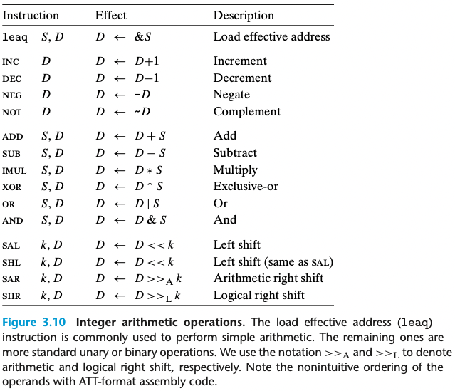
##### 3.5.1 Load Effective Address
The *load effective address* instruction leap is actually a variant of the movq instruction. Its first operand appears to be memory reference, but instead of reading from the designated location, the instruction copies the effective address to the destination. In addition, it can be used to compactly describe common arithmetic operations. For example, if register %rdx contains value x, then the instruction leaq 7(%rdx, %rdx, 4), %rax will set register %rax to 5x+7. ==The destination operand must be a register. 
######## Practice Problem 3.6 
Suppose register %rbx holds value p and %rdx holds value q. Fill in the table below with formulas indicating the value that will be stored in register %rax for each of the given assembly-code instructions:
|Instruction|Result|
|----|----|
|leaq 9(%rdx), %rax |9+q|
|leaq (%rdx, %rbx), %rax |q+p|
|leaq (%rdx, %rbx, 3), %rax |q+3p|
|leaq 2(%rbx, %rbx, 7), %rax |8p+2|
|leaq 0xE(, %rdx, 3), %rax |3q+14|
|leaq 6(%rbx, %rdx, 7), %rax |p+7q+6| 

As an illustration of the use of leaq in compiled code, consider the following C program:
```c
long scale(long x, long y, long z){
    long t = x + 4 * y + 12 * z;
    return t;
}
```
Assembly code:
```
x in %rdi, y in %rsi, z in %rdx
scale:
    leaq (%rdi, %rsi, 4), %rax  x+4*y
    leaq (%rdx, %rdx, 2), %rdx  z+2*z=3*z
    leaq (%rax, %rdx, 4), %rax  (x+4*y)+4*(3*z)=x+4*y+12*z
    ret
```
######## Practice Problem 3.7
Consider the following code, in which we have omitted the expression being computed:
```c
    short scale3(short x, short y, short z){
        short t = ____; // 10y+z+x*y
        return t;
    }
```
Compiling the actual function with gcc yields the following assembly code:
```
    short scale3(short x, short y, short z)
    x in %rdi, y in %rsi, z in %rdx
scale3:
  leaq (%rsi,%rsi,9), %rbx  y+9y=10y
  leaq (%rbx,%rdx), %rbx    10y+z
  leaq (%rbx,%rdi,%rsi), %rbx   10y+z+x*y
  ret
```
##### 3.5.2 Unary and Binary Operations
The operand can be either a ==register or a memory location==.
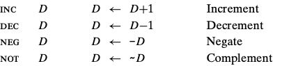
The second operand is used as both a source and a destination. The first operand can be either ==an immediate value, a register, or a memory location. The second can be either a register or a memory location. ==As with the MOV instructions, the two operands cannot both be memory location.
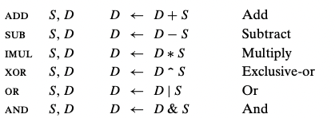
######## Practice Problem 3.8
Assume the following values are stored at the indicated memory addresses and registers:

Fill in the following table showing the effects of the following instructions, in terms of both the register or memory location that will be updated and the resulting value:
|Instruction| Destination | Value |Comment|
|----|----|----|----|
|addq %rcx, (%rax)|0x100|0x100|0xFF+0x1=0x100|
|subq %rdx, 8(%rax)|0X108|0xA8|0xAB-0x3=0xA8|
|imulq $16, (%rax, %rdx, 8)|0x118|0x110|0x10*0x11=0x110|
|incq 16(%rax)|0x110|0x14|0x13+0x1=0x14|
|decq %rcx|%rcx|0x0|0x1-0x1=0x0|
|subq %rdx, %rax|%rax|0xFD|0x100-0x3=0xFD|
##### 3.5.3 Shift Operations
==The shift amount is given first and the value to shift is given second. The different shit instructions can specify the shift amount either as an immediate value or with the single-byte register %cl(specific register).== In principle, having 1-byte shift amount would make it possible to encode shift amounts ranging up to $2^8-1=255$.With x86-64, a shift instruction operating on data values that are w bits long determines the shift amount from the low-order m bits of register %cl has hexadecimal value 0xFF, the instruction salb would shift by 7, while salw would shift by 15, sall would shift by 31, and salq would shift byt 63.
SAL and SHL both have same effect, filling from the right with zeros. ==The right shift instructions differ in that SAR performs an arithmetic shift(fill with copies of the sign bit), whereas SHR performs a logical shift(fill with zero). The destination operand of a shift operation can be either a register or a memory location.==

######## Practice Problem 3.9
Suppose we want to generate assembly code for the following C function:
```c
long shift_left4_rightn(long x, long n){
    x <<= 4;
    x >>= n;
    return x;
}
```
leaves the final value in register %rax. Parameters x and n are stored in registers %rdi and %rsi, respectively.
```
long shift_left4_rightn(long x, long n)
   x in %rdi, n in %rsi
shift_left4_rightn:
  movq    %rdi, %rax    Get x
  salq    4,    %rax    x <<=4
  movl    %esi, %ecx    Get n(4bytes)
  sarq    %cl, %rax    x >>= n
```
Note: Shift instructions are unusually in only allowing this specific register as the operand.
(a)C code
```c
long arith(long x, long y, long z){
    long t1 = x ^ y;
    long t2 = z * 48;
    long t3 = t1 & 0x0F0F0F0F;
    long t4 = t2 - t3;
    return t4;
}
```
(b) Assembly code
```
    long arith(long x, long y, long z)
     x in %rdi, y in %rsi, z in %rdx
1 arith:
2   xorq %rsi, %rdi     t1=x^y
3   leaq (%rdx, %rdx, 2), %rax  3*z
4   salq $4,    %rax    t2=16*(3*z)=48*z
5   andl $252645135, %edi   t3=t1&0x0F0F0F0F
6   subq %rdi, %rax     Return t2-t3
7   ret
```

######## Practice Problem 3.10
```c
short arith3(short x, short y, short z)
{
    short p1 =  x|y ; 
    short p2 =  p1>>3 ;
    short p3 =   ~p2; 
    short p4 =   z-p3;
    return p4;
}
----------------
Assembly code
  x in %rdi, y in %rsi, z in %rdx
arith3:
  orq     %rsi, %rdi
  sarq    $3, %rdi
  notq    %rdi
  movq    %rdx, %rax
  subq    %rdi, %rax
  ret
```
###### Practice Problem 3.11
It is common to find assembly-code lines of the form`xorq %rcx,%rcx` in code that was generated from C where no exclusive-or operations were present.
A. Explain the effect of this particular exclusive-or instruction and what useful operation it implements.
B. What would be the more straightforward way to express this operation in assembly code?
C. Compare the number of bytes to encode any two of these three different implementations of the same operation.
A. The instr is used to set register %rcx to zero.
B. same with movq \$0, %rcx
C. Assembling and disassembling this code, however we find that xorq only needs 3 bytes, while the version with movq requires 7. Other ways to set %rcx to zero rely on the property that any instruction that updates the lower 4 bytes will cause the high-order bytes to be set to zero. Thus, we could use either xorl %ecx, %ecx(2bytes) or movl $0,%ecx(5 bytes).
##### 3.5.5 Special Arithmetic Operations
little-endine: the high-order are stored at higher address